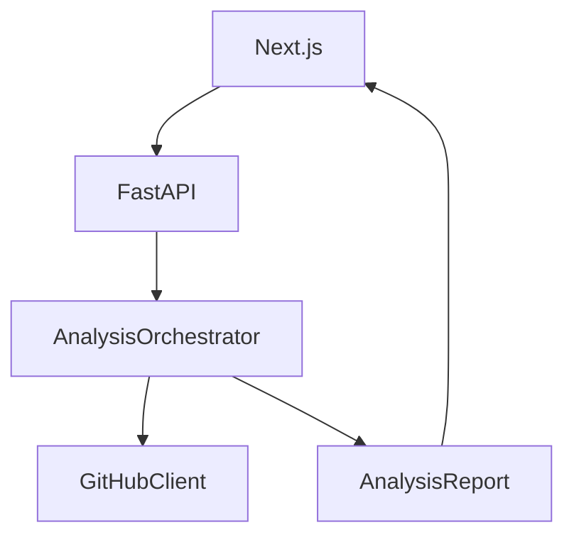

# PRISM

**GitHub Pull Request Analyzer** — understand what changed before you review it.

PRISM is a production-structured portfolio tool that fetches a GitHub pull request, runs a **deterministic** analysis engine (no LLM, no paid API, no API key required), and renders an engineering review report with a professional dark/light developer-tool UI.

```
Paste PR URL → FastAPI → GitHub API → Normalizer → Analyzers → AnalysisReport → Dashboard
```

## Why it exists

Code review starts with orientation: what changed, where risk concentrates, whether tests moved with the change, and what questions to ask. PRISM automates that orientation with explainable, evidence-backed findings — and is designed so an LLM can be plugged in later without rewriting the engine.

## Features (MVP)

- Public GitHub PR URL analysis (optional `GITHUB_TOKEN` only for higher rate limits)
- Session-aware welcome page + guest mode for public PRs / demo without signing in
- Optional **Sign in with GitHub** (OAuth) for private repositories and your open PRs feed
- Dark/light theme (dark by default)
- Change statistics, risk indicators, complexity (Python + JS/TS heuristics)
- Testing considerations, dependency diffs, impact edges, review questions
- Built-in **Try Demo PR** (works offline / when rate-limited)
- AI provider interface present; `AI_ENABLED=false` by default (`ai_analysis: null`)

## Architecture

See [docs/architecture.md](docs/architecture.md), [docs/analysis-engine.md](docs/analysis-engine.md), and [docs/ai-integration.md](docs/ai-integration.md).



## Tech stack

| Layer | Stack |
|-------|--------|
| Frontend | Next.js, React, TypeScript, Tailwind CSS 4, Headless UI, TanStack Query |
| Backend | Python, FastAPI, Pydantic, httpx, radon |
| Tooling | ESLint, Prettier, Ruff, pytest, Docker Compose, GitHub Actions |

## Monorepo layout

```
apps/web          Next.js dashboard
apps/api          FastAPI analysis service
packages/shared   Shared TypeScript report types
fixtures/github   GitHub response fixtures + demo PR
docs/             Architecture & AI extension docs
```

## Theming and constants

Central places to change branding and paths without hunting through components:

| What | Where |
|------|--------|
| Primary / secondary colors | [`apps/web/src/styles/theme.css`](apps/web/src/styles/theme.css) (`--brand-primary`, `--brand-secondary`) |
| Page routes + logo assets | [`apps/web/src/constants/routes.ts`](apps/web/src/constants/routes.ts) (`Routes.home`, `Routes.assets_logoShort`, …) |
| API fetch paths | [`apps/web/src/constants/api-routes.ts`](apps/web/src/constants/api-routes.ts) |
| Cookie / theme storage keys | [`apps/web/src/constants/storage.ts`](apps/web/src/constants/storage.ts) |
| API path prefixes + cookies | [`apps/api/app/core/constants.py`](apps/api/app/core/constants.py) |

Components use semantic Tailwind utilities (`bg-primary`, `text-muted`, `border-border`) mapped from those CSS tokens.

## How analysis works

1. Validate `https://github.com/{owner}/{repo}/pull/{number}`
2. Fetch PR + files + commits via GitHub REST (or load fixtures for demo)
3. Normalize into internal models (analyzers never see raw GitHub JSON)
4. Run Change / Test / Risk / Dependency / Complexity / Impact analyzers
5. Generate contextual review questions from findings
6. Optionally invoke `AnalysisProvider` when AI is enabled
7. Return structured `AnalysisReport`

**Supported languages (deeper analysis):** Python, JavaScript, TypeScript  
**Others:** graceful line/file-level fallback

**Risk methodology:** path and content pattern indicators (auth, DB, API, deps, etc.). These are **not** vulnerability claims.

## Run locally

### Prerequisites

- Node.js 20+
- Python 3.11+ (with API deps installed)
- (Optional) Docker

### One command (API + web)

```bash
# install Python API deps once
cd apps/api && python -m pip install -r requirements.txt && cd ../..

# from repo root
npm install
npm run dev
```

This starts FastAPI on http://127.0.0.1:8000 and Next.js on http://localhost:3000 (the web app proxies `/api/*` to the API).

### API only

```bash
npm run dev:api
# or:
cd apps/api
python -m pip install -r requirements.txt
python -m uvicorn app.main:app --reload --host 127.0.0.1 --port 8000
```

### Web only

```bash
npm run dev:web
```

### Tests

```bash
cd apps/api
python -m pytest -q
```

### Docker

```bash
docker compose up --build
```

- Web: http://localhost:3000  
- API: http://localhost:8000/api/v1/health  

## Signing in

First visit opens `/welcome`. You can:

- **Sign in with GitHub** — unlocks private repos and the **Your open pull requests** panel (authored / review-requested / assigned).
- **Continue without signing in** — sets a `prism_guest` cookie so public PRs and the demo work from the home workspace.

PRISM cannot use your github.com browser session. It needs its own OAuth App credentials. If **Sign in with GitHub** is disabled, create an OAuth App (see below) and set env vars in `apps/api/.env` — the UI explains this instead of hiding the button.

### Private repositories / OAuth setup

1. Create a GitHub OAuth App at [github.com/settings/developers](https://github.com/settings/developers).
2. Set **Authorization callback URL** to:
   `http://localhost:3000/api/v1/auth/github/callback`
3. Copy Client ID and Client Secret into `apps/api/.env`:

```env
GITHUB_OAUTH_CLIENT_ID=...
GITHUB_OAUTH_CLIENT_SECRET=...
SESSION_SECRET=generate-a-long-random-string
PUBLIC_WEB_URL=http://localhost:3000
```

4. Restart `npm run dev`, then sign in from `/welcome` or the home header.

The access token stays server-side in an encrypted HttpOnly cookie. It is never sent to browser JavaScript. Disconnect revokes the grant when possible.

**Open PRs API:** `GET /api/v1/me/pull-requests?filter=authored|review_requested|assigned` (requires session). Results are cached 60s per viewer/filter.

**Note:** GitHub OAuth Apps require the `repo` scope for private repository access (there is no read-only private scope for classic OAuth Apps). Prefer a GitHub App later for finer permissions.

## Environment

| Variable | Default | Notes |
|----------|---------|--------|
| `GITHUB_TOKEN` | unset | Optional; higher public rate limits only |
| `GITHUB_OAUTH_CLIENT_ID` | unset | Enables Connect GitHub when set with secret |
| `GITHUB_OAUTH_CLIENT_SECRET` | unset | OAuth App secret |
| `SESSION_SECRET` | unset | Fernet key material (falls back to client secret) |
| `PUBLIC_WEB_URL` | `http://localhost:3000` | Used for OAuth callback + cookie Secure flag |
| `SESSION_TTL_SECONDS` | `28800` | Session lifetime (8h) |
| `AI_ENABLED` | `false` | Keep false unless wiring an AI provider |
| `MAX_FILES` | `100` | Partial analysis beyond limit |
| `CORS_ORIGINS` | `http://localhost:3000,...` | Comma-separated |
| `API_ORIGIN` | `http://127.0.0.1:8000` | Next.js rewrite target |

## Limitations

- Private repos require Connect GitHub (OAuth App credentials)
- Not every language has AST-level complexity analysis
- Impact graph is heuristic, not a perfect dependency graph
- Diff viewer is readable, not GitHub-parity
- Unauthenticated GitHub API is rate-limited — use **Try Demo PR**

## Roadmap

- **Phase 2:** Analysis history, better language support, finer GitHub App permissions  
- **Phase 3:** GitHub App automation, PR comments, CI integration  
- **Phase 4:** Optional AI providers (Ollama / hosted), semantic summaries  

## License

MIT
